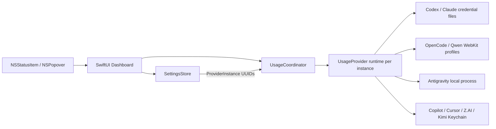

<div align="center">
  
  <h1>AIUsage</h1>
  <p><strong>複数のAIサービス・複数アカウントの使用枠を、macOSのメニューバーからまとめて確認。</strong></p>
  <p>必要なアカウントだけを追加して、残量・リセット時刻・取得状態をひとつのPopoverで確認できる軽量なmacOSメニューバーアプリです。</p>

  <p>
    <a href="https://github.com/PeachGumi/AIUsage/actions/workflows/ci.yml"></a>
    
    
    <a href="LICENSE"></a>
  </p>
</div>

> [!IMPORTANT]
> AIUsageは各Providerの公式アプリ・公式SDKではありません。使用量取得には、公式クライアントのローカル状態や、安定性が保証されていないusage endpoint / ローカルinterfaceを利用する統合があります。Provider側の変更により一時的に取得できなくなる可能性があります。

> [!WARNING]
> 実アカウントで検証済みなのは **OpenCode Go / OpenAI Codex / GitHub Copilot / Antigravity** です。Qwen Cloud、Claude、Cursor、Z.AI、Kimi CodeはExperimentalです。表示値は公式dashboardと照合してください。

## 特徴

- **複数アカウント** — OpenAI Codex、Claude、OpenCode GoなどをPersonal / Workの別カードとして登録できます。
- **UUID単位で状態を分離** — snapshot、error、認証状態、更新状態、並び順、メニューバー固定先をカードごとに管理します。
- **ambient認証は1枚目だけ** — 外部CLI/アプリの通常ログインを使えるのは各Providerのstable default cardだけ。2枚目以降は明示的なcredentialが必要です。
- **使うアカウントだけ追加** — 初回起動は0件。未登録Providerへusage取得通信を行いません。
- **独立更新** — 1アカウントの遅延・失敗がほかのカードを待たせません。
- **stale snapshotを保持** — 一時的な通信失敗では直前の正常値を残します。
- **ドラッグで並び替え** — 任意のカードをメニューバー表示へ固定できます。
- **ローカル中心** — 独自バックエンド、広告SDK、分析SDK、テレメトリーはありません。

## インストール

### 必要環境

| 項目 | 要件 |
|---|---|
| OS | macOS 14 Sonoma 以降 |
| ソースビルド | Xcode 16.2 以降 |
| アーキテクチャ | Xcodeが対象macOS向けにビルドできるMac |

> [!NOTE]
> 現在、GitHub Releasesで一般ユーザー向けの署名・公証済みバイナリは配布していません。現時点での正式な導入方法はソースからのビルドです。

```bash
git clone https://github.com/PeachGumi/AIUsage.git
cd AIUsage
./Scripts/build_release.sh
open build/dist/AIUsage.app
```

`build_release.sh` はUnit Tests → Release build → ad-hoc署名 → ZIP → SHA-256 checksumを実行します。

```text
build/dist/AIUsage.app
build/dist/AIUsage-macOS.zip
build/dist/AIUsage-macOS.zip.sha256
```

この署名はローカル利用・検証向けのad-hoc署名で、Developer ID署名やApple notarizationではありません。

## 使い方

1. AIUsageを起動します。初回はメニューバーに `AI +` と表示されます。
2. Popover右上の **+** からProviderを追加します。
3. 1枚目は必要に応じて通常のCLI / アプリloginまたはAIUsage内Web loginを利用します。
4. 同じProviderの2枚目以降を追加した場合は **Account… / Sign in / API key…** から、そのカード専用の認証元を設定します。
5. **Rename…** で `Personal` / `Work` などのローカル表示名を付けられます。
6. カードをクリックすると、そのアカウントがメニューバー表示へ固定されます。
7. 左端のドラッグハンドルで並び替えられます。
8. **Settings** からRemaining / Usedの切り替えと、ログイン時の自動起動を設定できます。

登録済みカードだけが起動時・定期更新・Popover表示時・Refresh Allの対象です。バックグラウンド更新間隔は5分です。

### カード操作

| 操作 | 内容 |
|---|---|
| `Refresh` | そのカードだけ再取得 |
| `Sign in` | OpenCode Go / Qwenのカード専用WebKit sessionへログイン |
| `Account…` | Codex / Claudeのcredential file、Copilot / Cursor / Kimiのカード固有credentialなどを設定 |
| `API key…` | Z.AIのカード固有API keyをKeychainへ保存 |
| `Sign out` | AIUsageが所有するWeb login / API keyを削除できるProviderでログアウト |
| `Rename…` | ローカル表示名を変更 |
| `Open dashboard` | Providerの使用量ページを開く |
| `Remove` | カードを削除し、そのUUID専用のAIUsage所有credential / session / pathを掃除 |

## 複数アカウントの設計

AIUsageでは統合種別とカードを分けています。

- `ProviderID` — OpenAI Codex、Claude、Cursorなどの統合種別
- `ProviderInstance` — 固有UUIDを持つ1アカウントカード

各Providerの**最初のカードはstable default slot**です。旧バージョンからの移行IDと同じstable UUIDを使い、このカードだけが通常のCLI / アプリのambient credentialを利用できます。

追加カードはランダムUUIDを持ち、別アカウントとして明示的に設定します。これにより、credential未設定の2枚目が1枚目と同じアカウントを黙って表示することを防ぎます。

### Provider別の分離

| Provider | default card | 追加カード |
|---|---|---|
| OpenCode Go | default WebKit profile / 旧workspace移行 | UUID別persistent WebKit profile + workspace ID |
| Qwen Cloud | default WebKit profile / 旧Cookie移行 | UUID別persistent WebKit profile + Cookie repository |
| OpenAI Codex | 通常のCodex `auth.json` | 別profileの`auth.json`を **Account…** で選択必須 |
| Claude | 通常のClaude Code credential | 別credential fileを **Account…** で選択必須 |
| GitHub Copilot | `GH_TOKEN` / `GITHUB_TOKEN` / GitHub CLI | カード固有GitHub tokenをKeychainへ保存必須 |
| Cursor | Cursor.appの現在のlogin | カード固有access tokenをKeychainへ保存必須 |
| Z.AI | legacy key / environmentも互換利用可 | UUID別API key必須 |
| Kimi Code | Kimi CLI / environment | カード固有API keyをKeychainへ保存必須 |
| Antigravity | 公式Antigravityの現在のlocal session | **現在は追加不可** |

### Antigravity

Antigravityは**1つのlocal sessionだけ**を表示します。AIUsageは実行中の公式Antigravityプロセス（CLI / アプリ）からlocalhost上のusage情報を取得し、Google OAuth tokenを作成・保存したり、Googleのremote quota endpointへ直接アクセスしたりしません。

Antigravityの2アカウント目は現時点では追加できません。将来は、公式Antigravity CLIがcustom status-line scriptへ渡すdocumented JSON（quota / email / plan tierなど）を使ったpassive local integrationへ移行する予定です。第三者OAuth credentialを再利用する方式は採用しません。

> [!NOTE]
> 現行Antigravity integrationは実行中のlocal processを検出するため、Antigravityを起動・ログインした状態でRefreshしてください。

### Remove と外部ログアウト

**Remove** はカードUUIDに属するAIUsage所有データを掃除します。

- UUID別Keychain secretを削除
- Codex / Claudeで選択したcredential file pathを削除（ファイル本体は削除しない）
- 新規OpenCode / Qwenカードの専用WebKit sessionとworkspace情報を削除
- in-flight取得を無効化し、古い結果が削除済みカードへ戻らないようにする

一方、Codex CLI、Claude Code、GitHub CLI、Cursor.app、Kimi Code、Antigravityなど**外部クライアントが所有する認証情報は変更・削除しません**。

## 対応Provider

| Provider | 状態 | 使用枠 | 認証 / 取得方式 |
|---|---|---|---|
| **OpenCode Go** | 検証済み | 5-hour / Weekly / Monthly | AIUsage内Web login。カードごとにWebKit分離 |
| **OpenAI Codex** | 検証済み | 5-hour / Weekly | defaultはCodex CLI OAuth、追加カードは別`auth.json` |
| **Qwen Cloud** | Experimental | 5-hour / Weekly | AIUsage内Web login。カードごとにWebKit分離 |
| **Claude** | Experimental | 5-hour / Weekly | defaultはClaude Code OAuth、追加カードは別credential file |
| **Antigravity** | 検証済み | Gemini / Claude・GPTの5-hour / Weekly | 実行中の公式Antigravity local process。現在1カードのみ |
| **GitHub Copilot** | 検証済み | Monthly quota | defaultはGitHub CLI/env、追加カードはKeychain token |
| **Cursor** | Experimental | Monthly usage pools | defaultはCursor.app、追加カードはKeychain token |
| **Z.AI GLM** | Experimental | 5-hour / Weekly | UUID別Coding Plan API key |
| **Kimi Code** | Experimental | 5-hour / Weekly | defaultはKimi CLI/env、追加カードはKeychain API key |

Experimental統合は未知のレスポンス形状を0%として推測せず、エラーとしてfail closedします。

> [!NOTE]
> **Experimental Providerの実アカウント検証・修正に協力してくださる方を募集しています。** Qwen Cloud、Claude、Cursor、Z.AI、Kimi Codeを利用している方から、公式dashboardとの照合結果をもとにしたfixture / parser / integration修正のPull Requestを歓迎します。OAuth token、API key、Cookie、account ID、workspace ID、認証済みAPIレスポンス全文などの秘密情報はIssueやPull Requestへ含めないでください。

## 表示と更新

- メニューバーには選択中の1カードを表示します。
- Popoverには登録済みカードをすべて表示します。
- Popoverを開いた時、直近の全体更新から60秒以上経過していれば更新します。
- アプリがactiveになった時・スリープ復帰時は120秒以上古ければ更新します。
- 定期更新は5分間隔です。
- 全体更新はカードごとに独立して開始します。
- 重複する全体更新要求はcoalesceします。
- newer refresh / Sign out / Removeで無効になった古い非同期結果は破棄します。
- 一時的な失敗では直前の正常snapshotと認証済み状態を不必要に破壊しません。

## プライバシーとセキュリティ

| 項目 | 方針 |
|---|---|
| 独自バックエンド | なし |
| 分析 / 広告 / テレメトリー | なし |
| 未登録Providerへのusage取得 | 行わない |
| 状態分離 | ProviderInstance UUID単位 |
| ambient credential | stable default cardだけ |
| 追加カード | 明示credential必須。兄弟カードへfallbackしない |
| AIUsage所有secret | macOS Keychain |
| OpenCode / Qwen | UUID別WebKit data store |
| Provider HTTP session | ephemeral、共有Cookie / credential / URL cacheなし |
| credential付きHTTP redirect | 拒否 |
| 外部client credential | 読み取り専用。AIUsageから変更・削除しない |
| ログ | OAuth token、API key、Cookie、account ID、workspace ID、実usage本文を出力しない |

詳細は [PRIVACY.md](PRIVACY.md) と [SECURITY.md](SECURITY.md) を参照してください。

> [!CAUTION]
> IssueやPull RequestへOAuth token、API key、Cookie、account ID、workspace ID、認証済みAPIレスポンス全文を貼らないでください。

## トラブルシューティング

<details>
<summary><strong>Providerが何も表示されない</strong></summary>

正常です。初回は0件です。Popover右上の **+** から追加してください。

</details>

<details>
<summary><strong>2枚目のカードが認証エラーになる</strong></summary>

意図した動作です。外部CLI/アプリのambient loginはdefault cardだけに限定しています。2枚目は **Account… / Sign in / API key…** から別アカウントを設定してください。

</details>

<details>
<summary><strong>Antigravityを2枚追加できない</strong></summary>

現在は1 local sessionだけ対応しています。第三者Google OAuthによる複数アカウント化は行いません。公式CLIのstatus-line payloadを使う方式を今後の候補にしています。

</details>

<details>
<summary><strong>Antigravityが取得できない</strong></summary>

公式Antigravityを起動し、ログインしてからRefreshしてください。現在のExperimental integrationは実行中local processを検出します。

</details>

<details>
<summary><strong>Removeすると何が消える？</strong></summary>

そのカードUUIDだけに属するAIUsage所有credential、credential path、新規OpenCode / Qwenカードの専用sessionなどを削除します。外部CLI/アプリの認証自体は削除しません。

</details>

## 開発

### アーキテクチャ



- `Sources/App` — 起動、status item、ProviderInstance action、credential配線
- `Sources/Core` — Provider共通モデル、永続設定、更新調停
- `Sources/Providers` — 通信、認証情報の読み取り、parser
- `Sources/UI` — Popover、Settings、Web login
- `Tests` — Core / Provider / UI / opt-in live tests

### テスト

```bash
xcodebuild test \
  -project AIUsage.xcodeproj \
  -scheme AIUsage \
  -destination 'platform=macOS' \
  CODE_SIGNING_ALLOWED=NO \
  SWIFT_TREAT_WARNINGS_AS_ERRORS=YES

xcodebuild build \
  -project AIUsage.xcodeproj \
  -scheme AIUsage \
  -configuration Release \
  CODE_SIGNING_ALLOWED=NO \
  SWIFT_TREAT_WARNINGS_AS_ERRORS=YES
```

CIではSwift sourceのXcode project登録漏れ、release scriptのshell構文、compiler warningも検査します。

### Live Tests

実アカウントLive Testsは明示的opt-in時だけ実行します。

```bash
touch /tmp/aiusage-live-tests-enabled
xcodebuild test \
  -project AIUsage.xcodeproj \
  -scheme AIUsage \
  -destination 'platform=macOS' \
  CODE_SIGNING_ALLOWED=NO \
  -only-testing:AIUsageTests/LiveProviderTests
rm -f /tmp/aiusage-live-tests-enabled
```

Live Testsでもtoken、Cookie、実使用率をログへ出しません。

### Provider追加ルール

新しいProviderは実装だけで公開しません。

1. `ProviderID`を追加
2. `UsageProvider`を実装
3. default cardとduplicate cardのcredential sourceを明確化
4. 兄弟instanceへのambient fallbackを禁止
5. 認証情報の送信先を明確化
6. parser / transport / failure behaviorをfixtureでテスト
7. duplicate instanceのrefresh / remove / rebuild / sign-out分離をテスト
8. 実アカウントで可能ならLive Test
9. 公開品質になってから`ProviderID.implemented`へ追加

詳しくは [CONTRIBUTING.md](CONTRIBUTING.md) を参照してください。

## ロードマップ

公開品質に向けた残課題は [Public release readiness #2](https://github.com/PeachGumi/AIUsage/issues/2) で管理しています。

主なテーマ:

- Experimental Providerの実アカウント検証
- Antigravity公式CLI status-line payloadによるpassive local integration / multi-account検討
- Qwen / OpenCodeの追加fault injection
- login lifecycle / UI end-to-end tests
- Provider仕様変更を検知するcontract tests
- アクセシビリティ / multi-display検証
- GitHub Releases / インストール導線
- changelog / screenshots

## コントリビューション

Issue / Pull Requestを歓迎します。Provider連携は認証済みセッションと不安定な上流仕様を扱うため、変更前に [CONTRIBUTING.md](CONTRIBUTING.md) の安全要件を確認してください。

## セキュリティ報告

脆弱性や認証情報漏えいにつながる問題については、公開Issueへ秘密情報を書かず [SECURITY.md](SECURITY.md) の手順に従ってください。

## ライセンス

[MIT License](LICENSE)

各サービス名・ロゴ・商標は各権利者に帰属します。AIUsageは各Providerから承認・提携を受けた製品ではありません。

## 謝辞

OpenAI CodexおよびProvider usage統合の調査では、MITライセンスの [CodexBar](https://github.com/steipete/CodexBar) を参考にしています。詳細は [NOTICE](NOTICE) を参照してください。
