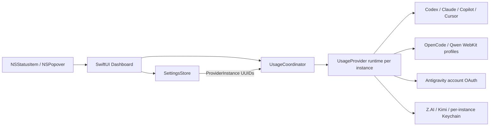

<div align="center">
  
  <h1>AIUsage</h1>
  <p><strong>複数のAIサービス・複数アカウントの使用枠を、macOSのメニューバーからまとめて確認。</strong></p>
  <p>必要なアカウントだけを追加して、残量・リセット時刻・取得状態をひとつのPopoverで確認できる軽量なmacOSメニューバーアプリです。</p>

  <p>
    <a href="https://github.com/PeachGumi/AIUsage/actions/workflows/ci.yml"></a>
    
    
    <a href="LICENSE"></a>
  </p>

  <p>
    <a href="#特徴">特徴</a> ·
    <a href="#インストール">インストール</a> ·
    <a href="#使い方">使い方</a> ·
    <a href="#複数アカウント">複数アカウント</a> ·
    <a href="#対応プロバイダー">対応プロバイダー</a> ·
    <a href="#トラブルシューティング">FAQ</a> ·
    <a href="#開発">開発</a>
  </p>
</div>

> [!IMPORTANT]
> AIUsageは各プロバイダーの公式アプリ・公式SDKではありません。使用量の取得には、各サービスの非公開または安定性が保証されていないendpoint / ローカルクライアント情報を利用しています。サービス側の変更により、一時的に取得できなくなる可能性があります。

> [!WARNING]
> 実アカウントで検証済みなのは **OpenCode Go / OpenAI Codexのみ** です。Qwen Cloud、Claude、Antigravity、GitHub Copilot、Cursor、Z.AI、Kimi Codeはfixtureテスト済みの実験的統合で、Add Provider画面でもExperimentalと表示されます。表示値は必ず公式dashboardと照合してください。

## 特徴

- **同じProviderを何アカウントでも追加** — たとえばOpenAI CodexのPersonal / Workを別カードとして登録できます。
- **カードごとに独立した状態** — snapshot、error、認証状態、更新状態、並び順、メニューバー固定先をUUID単位で管理します。
- **使うアカウントだけ追加** — 初回起動は0件。登録していないProviderにはusage取得通信を行いません。
- **メニューバーだけで残量を確認** — 選択したアカウントの使用枠を常時コンパクトに表示します。
- **1クリックで全体表示** — メニューバー直下のPopoverに、登録済みアカウントをカード形式で表示します。
- **独立更新** — 1アカウントが遅い・失敗した場合でも、ほかのアカウントの更新を巻き込みません。
- **最後に取得できた値を保持** — 一時的な通信失敗時は、直前の正常値をstale表示として残します。
- **ドラッグで並び替え** — カードの順序を変更し、任意のアカウントをメニューバー表示へ固定できます。
- **画面サイズに合わせて伸縮** — カード数が少ない間はPopover自体を縦に伸ばし、画面に収まらなくなった時だけ内部スクロールします。
- **ローカル中心の設計** — 独自サーバー、広告SDK、分析SDK、テレメトリーはありません。

## インストール

### 必要環境

| 項目 | 要件 |
|---|---|
| OS | macOS 14 Sonoma 以降 |
| ソースビルド | Xcode 16.2 以降 |
| アーキテクチャ | Xcodeが対象macOS向けにビルドできるMac |

> [!NOTE]
> 現在、GitHub Releasesで一般ユーザー向けの署名・公証済みバイナリは配布していません。現時点での正式な導入方法はソースからのビルドです。

### 最短で試す

```bash
git clone https://github.com/PeachGumi/AIUsage.git
cd AIUsage
./Scripts/build_release.sh
open build/dist/AIUsage.app
```

`build_release.sh` は次を順番に実行します。

1. Unit Tests
2. Release build
3. ad-hoc署名
4. ZIP作成
5. SHA-256 checksum作成

生成物:

```text
build/dist/AIUsage.app
build/dist/AIUsage-macOS.zip
build/dist/AIUsage-macOS.zip.sha256
```

この署名はローカル利用・検証向けの**ad-hoc署名**です。Developer ID署名やApple notarizationではありません。

### Xcodeから起動する

`AIUsage.xcodeproj` をXcode 16.2以降で開き、`AIUsage` schemeを選んでRunしてください。

通常のビルドとCIは、リポジトリにコミットされている `AIUsage.xcodeproj` を使用します。`project.yml` はプロジェクト構成の宣言にも利用しますが、日常のビルドにXcodeGenは必要ありません。

## 使い方

1. AIUsageを起動します。初回はメニューバーに `AI +` と表示されます。
2. `AI +` をクリックしてPopoverを開きます。
3. 右上の **+** から使いたいProviderを追加します。同じProviderは何度でも追加できます。
4. 必要なら各カードの **Sign in / Account… / API key…** から、そのカードで使うアカウントを設定します。
5. 同じProviderを複数登録した場合は、**Rename…** で `Personal` / `Work` などのローカル表示名を付けられます。
6. カードをクリックすると、そのアカウントがメニューバー表示へ固定されます。
7. 左端のドラッグハンドルでカードを並び替えられます。
8. **Settings** からメニューバーに表示する値を「Remaining / Used」で切り替えられます。

登録済みアカウントだけが、起動時・定期更新・Popover表示時・Refresh Allの対象になります。バックグラウンド更新間隔は5分です。

### カードの操作

| 操作 | 内容 |
|---|---|
| `Refresh` | そのカードだけ再取得 |
| `Sign in` | AIUsageがWeb認証を管理するProviderで、そのカード専用セッションへログイン |
| `Account…` | カード固有のtoken / credential file / Antigravity Google accountなどを設定 |
| `API key…` | Z.AI Coding Planなどのカード固有API keyをmacOS Keychainへ保存 |
| `Sign out` / `Disconnect` | 対応Providerで、そのカードのAIUsage所有認証だけを削除 |
| `Rename…` | カードのローカル表示名を変更 |
| `Open dashboard` | 各サービスの使用量ページをブラウザで開く |
| `Remove` | カードを削除し、そのUUID専用のAIUsage所有credential / session / pathを掃除 |

## 複数アカウント

AIUsageでは、Providerそのものと「画面上の1アカウント」を別の概念として扱います。

- `ProviderID` — OpenAI Codex、Claude、Antigravityなどの統合種別
- `ProviderInstance` — 固有UUIDを持つ1枚のアカウントカード

同じ`ProviderID`を持つ`ProviderInstance`を複数登録できます。更新、削除、認証エラー、stale snapshot、メニューバー固定先はすべてカードUUIDで分離されます。

### アカウント分離の方法

| Provider | 複数アカウント時の分離 |
|---|---|
| OpenCode Go | カードごとのpersistent WebKit profile + workspace ID |
| Qwen Cloud | カードごとのpersistent WebKit profile + Cookie repository |
| OpenAI Codex | カードごとに別の`auth.json`を選択可能。未指定時は通常のCodex profile |
| Claude | カードごとに別のcredential fileを選択可能。未指定時は通常のClaude Code profile |
| Antigravity | 新規カードごとにGoogle OAuth。token一式をUUID別にKeychain保存 |
| GitHub Copilot | カード固有GitHub tokenをKeychainへ保存可能。未指定時はambient GitHub認証 |
| Cursor | カード固有access tokenをKeychainへ保存可能。未指定時はCursor.appの既存認証 |
| Z.AI | カードUUIDごとのAPI keyをKeychainへ保存 |
| Kimi Code | カード固有API keyをKeychainへ保存可能。未指定時はCLI / environment認証 |

> [!NOTE]
> 旧バージョンから移行した最初のOpenCode / Qwen / Antigravityカードには互換経路があります。既存ユーザーのセッションを壊さないため、移行済み最初のカードだけは旧profile / ambient sessionを利用でき、新しく追加したカードへは共有しません。

### Remove と外部ログアウトの違い

**Remove** はカードUUIDに属するAIUsage所有データを掃除します。

- UUID別Keychain credentialを削除
- AntigravityのUUID別OAuth credentialを削除
- Codex / Claudeで選択したcredential file pathを削除（ファイル本体は削除しない）
- 新規OpenCode / Qwenカードの専用WebKit sessionとworkspace情報を削除

一方、Codex CLI、Claude Code、GitHub CLI、Cursor.app、Kimi Codeなど**外部クライアントが所有する認証情報は変更・削除しません**。それらから完全にログアウトしたい場合は公式クライアント側で操作してください。

## 対応プロバイダー

| プロバイダー | 状態 | 表示する使用枠 | 認証 / 取得方式 |
|---|---|---|---|
| **OpenCode Go** | 検証済み | 5-hour / Weekly / Monthly | AIUsage内Webログイン。カードごとにWebKit sessionを分離 |
| **OpenAI Codex** | 検証済み | 5-hour / Weekly | Codex OAuth。カードごとに別`auth.json`を選択可能 |
| **Qwen Cloud** | Experimental | 5-hour / Weekly | AIUsage内Webログイン。カードごとにWebKit sessionを分離 |
| **Claude** | Experimental | 5-hour / Weekly | Claude Code OAuth。カードごとにcredential fileを選択可能 |
| **Antigravity** | Experimental | Gemini / third-partyの5-hour・Weekly | 新規カードはGoogle OAuth + remote quota endpoint。移行済み旧カードは互換local sessionも利用可能 |
| **GitHub Copilot** | Experimental | Monthly quota | カード固有token、または`GH_TOKEN` / `GITHUB_TOKEN` / GitHub CLI認証 |
| **Cursor** | Experimental | Monthly usage pools | カード固有token、またはCursor.appの既存認証 |
| **Z.AI GLM** | Experimental | 5-hour / Weekly | カードUUIDごとのCoding Plan API key |
| **Kimi Code** | Experimental | 5-hour / Weekly | カード固有API key、またはKimi Code CLI認証 |

Experimental統合は未知のレスポンス形状を0%として推測せず、エラーとしてfail closedします。実アカウントで公式dashboardとの一致を確認できた場合は、秘密情報を除いた検証報告や修正Pull Requestを歓迎します。

## Antigravityについて

新しく追加したAntigravityカードは、ほかのAntigravityカードのambient local sessionを使いません。**各カードでGoogleアカウントを選択してOAuth接続**し、access token / refresh token / account metadataをそのカードUUID専用のmacOS Keychain itemへ保存します。

quota取得はGoogleのCloud Code系quota endpointへ直接問い合わせ、remoteレスポンスを既存Antigravity parserが扱える形へ正規化します。認証切れ時は、そのカードに保存したrefresh tokenだけを使って更新します。

OAuth client情報そのものはリポジトリへ固定値としてコミットせず、インストール済みAntigravity.appのartifactからruntime discoveryするか、開発者向けenvironment variableで与えます。

> [!WARNING]
> AntigravityはExperimentalです。Google側の非公開endpointやquota payloadはbuild / accountによって変わる可能性があります。未知のquota形状は推測せずfail closedします。

## 表示と更新の仕組み

- メニューバーには選択中の1アカウントだけを短縮表示します。
- Popoverには登録済みアカウントをすべて表示します。
- Popoverを開いた時、直近の全体更新から60秒以上経過していれば更新します。
- アプリがアクティブになった時・Macがスリープから復帰した時は、直近の全体更新から120秒以上経過していれば更新します。
- 定期更新は5分間隔です。
- 全体更新はカードごとに独立して開始され、遅いアカウントがほかを待たせません。
- 同時に複数の全体更新要求が発生した場合は重複実行を抑制します。
- 新しい更新、Sign out / Disconnect、Removeで無効になった古い非同期結果は破棄します。

エラーが発生しても過去の正常なsnapshotがある場合は値を残し、stale状態として表示します。これにより、一時的な通信障害だけで使用量表示が完全に消えることを避けています。

## プライバシーとセキュリティ

AIUsageは、認証済みセッションを扱うアプリとして「必要な宛先に必要な情報だけを送る」ことを重視しています。

| 項目 | 方針 |
|---|---|
| 独自バックエンド | なし |
| 分析 / 広告 / テレメトリー | なし |
| 未登録Providerへのusage取得 | 行わない |
| アカウント分離 | ProviderInstance UUID単位で認証・snapshot・error・refresh stateを分離 |
| 外部クライアント認証 | 読み取り専用。AIUsageから外部client-owned credentialを変更・削除しない |
| AIUsage所有の秘密情報 | カード固有API key / token / Antigravity OAuthはmacOS Keychain |
| OpenCode / Qwen | カード固有WebKit data store。新規カード間でCookieを共有しない |
| Provider HTTPセッション | ephemeral。共有Cookie・資格情報・URL cacheを使わない |
| 資格情報付きHTTP redirect | 拒否 |
| Qwen Cookie | HTTPSかつ送信先domain/path/expiryを確認して明示ヘッダーを構築 |
| ログ | OAuth token、refresh token、API key、Cookie、account ID、workspace ID、実usage本文を出力しない |

詳細は [PRIVACY.md](PRIVACY.md) と [SECURITY.md](SECURITY.md) を参照してください。

> [!CAUTION]
> 不具合報告にOAuth token、refresh token、API key、Cookie、Cookie header、account ID、workspace ID、認証済みAPIレスポンス全文を貼らないでください。Provider側の仕様変更を報告するIssue Formも、サニタイズ済み情報だけを前提にしています。

## 制約と注意事項

- 各サービスの公式usage SDKを使用しているわけではありません。
- 非公開endpointやDOM構造は予告なく変更される可能性があります。
- 上流の仕様変更直後は、一部Providerだけ取得できなくなることがあります。
- OpenCode Go / OpenAI Codex以外はExperimentalで、実アカウントとの一致を保証していません。
- GitHub Releasesによる署名・公証済み配布と自動アップデートはまだ提供していません。
- 各サービス名・商標は各権利者に帰属し、AIUsageは各社から承認・提携を受けた製品ではありません。

## トラブルシューティング

<details>
<summary><strong>起動したがProviderが何も表示されない</strong></summary>

正常です。AIUsageは初回起動時にProviderを自動登録しません。メニューバーの `AI +` をクリックし、Popover右上の **+** から使うProviderを追加してください。

</details>

<details>
<summary><strong>同じProviderを2つ追加したら同じ値が出る</strong></summary>

2枚目のカードで **Account… / Sign in / API key…** を使い、別アカウント用のcredentialを設定してください。

新規OpenCode / Qwen / Antigravityカードは別カードのsessionへ黙ってフォールバックしません。Codex / Claude / Copilot / Cursor / Kimiなどは、カード固有credentialを設定しない場合に通常のambient client credentialを使うため、未設定の複数カードでは同じアカウントが表示されることがあります。

</details>

<details>
<summary><strong><code>Codex login not found</code> と表示される</strong></summary>

Codex CLIでログイン済みか確認してください。別のCodexアカウントを監視する場合は、そのカードの **Account…** から別profileの`auth.json`を選択できます。AIUsageは認証ファイルを変更しません。

</details>

<details>
<summary><strong><code>Qwen Cloud login is required</code> と表示される</strong></summary>

対象Qwenカードの **Sign in** からログインしてください。新規カードはカードごとのpersistent WebKit profileを使います。

</details>

<details>
<summary><strong><code>OpenCode login is required</code> と表示される</strong></summary>

対象OpenCode Goカードの **Sign in** からログインしてください。ログイン後に検出したworkspace IDはカード固有namespaceへ保存されます。

</details>

<details>
<summary><strong>Antigravityの2枚目を追加したがusageが取れない</strong></summary>

新しいAntigravityカードは、既存のローカルAntigravity loginを自動共有しません。カードの **Account…** からGoogleアカウントを接続してください。Antigravity.appがインストールされておらずOAuth clientをruntime discoveryできない環境では、開発者向けenvironment variableが必要です。

</details>

<details>
<summary><strong>昨日まで取得できていたのに、急に失敗するようになった</strong></summary>

まずカードの **Refresh** を試してください。継続する場合は、Provider側の非公開APIまたはDOM変更の可能性があります。

1. [既存Issue](https://github.com/PeachGumi/AIUsage/issues)を検索する
2. 同じ問題がなければ、Provider breakage用Issue Formから報告する
3. 認証情報や実APIレスポンス全文は貼らない

</details>

<details>
<summary><strong>Removeすると何が消える？</strong></summary>

そのカードUUIDだけに属するAIUsage所有credential、credential path、新規OpenCode / Qwenカードの専用sessionなどを削除します。外部のCodex CLI / Claude Code / GitHub CLI / Cursor.app / Kimi Codeの認証自体は削除しません。

旧バージョンから移行した最初のカードが利用する共有legacy profileは、既存環境を壊さないため自動削除しません。

</details>

## 開発

### アーキテクチャ



責務は大きく次のように分離しています。

- `Sources/App` — アプリ起動、status item、ProviderInstance action、account credential配線
- `Sources/Core` — Provider共通モデル、UUIDベース登録設定、更新調停
- `Sources/Providers` — 認証情報の読み取り、通信、DOM/API解析
- `Sources/UI` — Popover、設定画面、ログイン画面
- `Tests` — Core / Provider / UI / opt-in live integration tests

### テスト

通常のCIは実アカウントや秘密情報を使わないfixture / stubだけで実行します。

```bash
xcodebuild test \
  -project AIUsage.xcodeproj \
  -scheme AIUsage \
  -destination 'platform=macOS' \
  CODE_SIGNING_ALLOWED=NO \
  SWIFT_TREAT_WARNINGS_AS_ERRORS=YES
```

Release build:

```bash
xcodebuild build \
  -project AIUsage.xcodeproj \
  -scheme AIUsage \
  -configuration Release \
  CODE_SIGNING_ALLOWED=NO \
  SWIFT_TREAT_WARNINGS_AS_ERRORS=YES
```

CIではさらに、すべてのSwiftファイルがコミット済みXcode projectのSources build phaseへ登録されていること、release scriptのshell構文、Swift compiler warningがないことを検査します。

### 実アカウントを使うLive Tests

Live Testsは明示的にopt-inしたローカル環境でのみ実行します。

```bash
touch /tmp/aiusage-live-tests-enabled
xcodebuild test \
  -project AIUsage.xcodeproj \
  -scheme AIUsage \
  -destination 'platform=macOS' \
  CODE_SIGNING_ALLOWED=NO \
  -only-testing:AIUsageTests/LiveProviderTests
rm -f /tmp/aiusage-live-tests-enabled
```

Live Testsでも、OAuth tokenやCookie、実使用率そのものはログへ出さない方針です。

### 新しいProviderを追加する

新規Providerは、実装を作っただけではユーザーへ公開しません。

1. `ProviderID` を追加
2. `UsageProvider` 実装を追加
3. ProviderInstanceを複数作った場合のcredential分離方式を決める
4. 認証情報の境界と送信先を明確化
5. parser / transport / failure behaviorをfixtureでテスト
6. `AppDelegate` のruntime factoryへ実装を登録
7. 同一Providerの2カードが互いの認証・stateを汚染しないことをテスト
8. 実アカウントで確認できる場合はopt-in Live Testで検証
9. 公開可能な品質になってから `ProviderID.implemented` へ追加

詳しいルールは [CONTRIBUTING.md](CONTRIBUTING.md) を参照してください。

## ロードマップ

公開品質に向けた残課題は [Public release readiness #2](https://github.com/PeachGumi/AIUsage/issues/2) で管理しています。

主なテーマ:

- Experimental Providerの実アカウント検証
- Qwen / OpenCodeの追加fault injection
- account login lifecycle / UI end-to-end tests
- Provider仕様変更を検知しやすくするcontract tests
- アクセシビリティとmulti-display検証
- GitHub Releases / インストール導線
- changelog / screenshots

## コントリビューション

Issue / Pull Requestを歓迎します。Provider連携は認証済みセッションと不安定な上流仕様を扱うため、変更前に [CONTRIBUTING.md](CONTRIBUTING.md) の安全要件を確認してください。

通常のバグは [Issues](https://github.com/PeachGumi/AIUsage/issues) から、Provider側の変更が疑われる場合は専用のProvider breakage Issue Formから報告できます。

## セキュリティ報告

脆弱性や認証情報漏えいにつながる問題については、公開Issueへ秘密情報を書かず [SECURITY.md](SECURITY.md) の手順に従ってください。

## ライセンス

[MIT License](LICENSE) で公開しています。

各サービス名・ロゴ・商標は各権利者に帰属します。AIUsageはOpenCode、OpenAI、Qwenその他のサービス提供者とは独立した非公式プロジェクトです。

## 謝辞

OpenAI CodexおよびAntigravityの使用量取得方式を調査する際、MITライセンスの [CodexBar](https://github.com/steipete/CodexBar) を参考にしています。ライセンス表記の詳細は [NOTICE](NOTICE) を参照してください。
