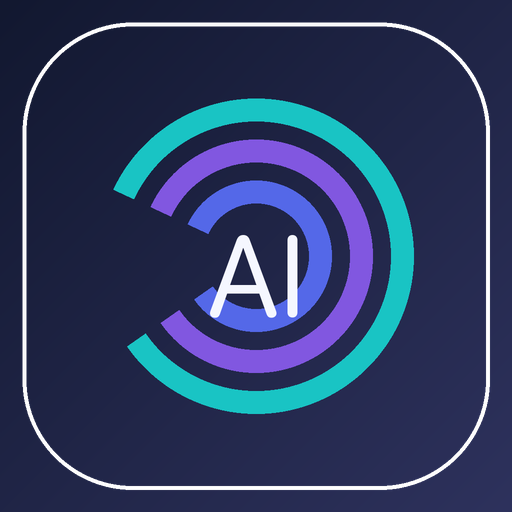
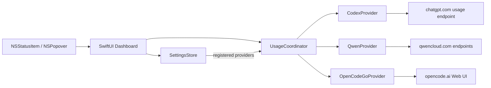

<div align="center">
  
  <h1>AIUsage</h1>
  <p><strong>複数のAIサービスの使用枠を、macOSのメニューバーからまとめて確認。</strong></p>
  <p>必要なプロバイダーだけを追加して、残量・リセット時刻・取得状態をひとつのPopoverで確認できる、軽量なmacOSメニューバーアプリです。</p>

  <p>
    <a href="https://github.com/PeachGumi/AIUsage/actions/workflows/ci.yml"></a>
    
    
    <a href="LICENSE"></a>
  </p>

  <p>
    <a href="#特徴">特徴</a> ·
    <a href="#インストール">インストール</a> ·
    <a href="#使い方">使い方</a> ·
    <a href="#対応プロバイダー">対応プロバイダー</a> ·
    <a href="#トラブルシューティング">FAQ</a> ·
    <a href="#開発">開発</a>
  </p>
</div>

> [!IMPORTANT]
> AIUsageはOpenCode、OpenAI、Qwenの公式アプリ・公式SDKではありません。使用量の取得には、各サービスの非公開または安定性が保証されていないendpoint / Webページ構造を利用しています。サービス側の変更により、一時的に取得できなくなる可能性があります。

## 特徴

- **使うサービスだけ追加** — 初回起動は0件。登録していないプロバイダーにはusage取得通信を行いません。
- **メニューバーだけで残量を確認** — 選択したプロバイダーの使用枠を常時コンパクトに表示します。
- **1クリックで全体表示** — メニューバー直下のPopoverに、登録済みプロバイダーをカード形式で表示します。
- **複数プロバイダーを独立更新** — 1サービスが遅い・失敗した場合でも、ほかのサービスの更新を巻き込みません。
- **最後に取得できた値を保持** — 一時的な通信失敗時は、直前の正常値をstale表示として残します。
- **ドラッグで並び替え** — カードの順序を変更し、任意のプロバイダーをメニューバー表示へ固定できます。
- **画面サイズに合わせて伸縮** — Provider数が少ない間はPopover自体を縦に伸ばし、画面に収まらなくなった時だけ内部スクロールします。
- **ローカル中心の設計** — 独自サーバー、広告SDK、分析SDK、テレメトリーはありません。

## インストール

### 必要環境

| 項目 | 要件 |
|---|---|
| OS | macOS 14 Sonoma 以降 |
| ソースビルド | Xcode 16.2 以降 |
| アーキテクチャ | Xcodeが対象macOS向けにビルドできるMac |

> [!NOTE]
> 現在、GitHub Releasesで一般ユーザー向けの署名・公証済みバイナリは配布していません。現時点での正式な導入方法はソースからのビルドです。

### 最短で試す

```bash
git clone https://github.com/PeachGumi/AIUsage.git
cd AIUsage
./Scripts/build_release.sh
open build/dist/AIUsage.app
```

`build_release.sh` は次を順番に実行します。

1. Unit Tests
2. Release build
3. ad-hoc署名
4. ZIP作成
5. SHA-256 checksum作成

生成物:

```text
build/dist/AIUsage.app
build/dist/AIUsage-macOS.zip
build/dist/AIUsage-macOS.zip.sha256
```

この署名はローカル利用・検証向けの**ad-hoc署名**です。Developer ID署名やApple notarizationではありません。

### Xcodeから起動する

`AIUsage.xcodeproj` をXcode 16.2以降で開き、`AIUsage` schemeを選んでRunしてください。

通常のビルドとCIは、リポジトリにコミットされている `AIUsage.xcodeproj` を使用します。`project.yml` はプロジェクト構成の宣言にも利用しますが、日常のビルドにXcodeGenは必要ありません。

## 使い方

1. AIUsageを起動します。初回はメニューバーに `AI +` と表示されます。
2. `AI +` をクリックしてPopoverを開きます。
3. 右上の **+** から使いたいプロバイダーを追加します。
4. 必要なら各カードの **Sign in** からログインします。CodexはCodex CLI側で事前にログインします。
5. カードをクリックすると、そのプロバイダーがメニューバー表示へ固定されます。
6. 左端のドラッグハンドルでカードを並び替えられます。
7. **Settings** からメニューバーに表示する値を「Remaining / Used」で切り替えられます。

登録済みプロバイダーだけが、起動時・定期更新・Popover表示時・Refresh Allの対象になります。バックグラウンド更新間隔は5分です。

### カードの操作

| 操作 | 内容 |
|---|---|
| `Refresh` | そのプロバイダーだけ再取得 |
| `Sign in` | AIUsage内のWebログインを開始（Codexを除く） |
| `Sign out` | AIUsageが保持する対象サービスのWebログイン状態を削除 |
| `Open dashboard` | 各サービスの使用量ページをブラウザで開く |
| `Remove` | AIUsageの登録一覧から外す。ログアウトはしない |

### Remove と Sign out の違い

**Remove** は「AIUsageで監視しない」にする操作です。再追加しやすいよう、WebKitのログインセッションやCodex CLIの認証状態は消しません。

**Sign out** は認証状態を削除する操作です。OpenCode Goでは保存済みworkspace IDも削除します。Codexの `~/.codex/auth.json` はAIUsageが書き換えないため、Codexから完全にログアウトする場合はCodex CLI側で行ってください。

## 対応プロバイダー

現在ユーザー向けに有効化しているのは次の3プロバイダーです。

| プロバイダー | 表示する使用枠 | 取得方式 | 初期設定 |
|---|---|---|---|
| **OpenCode Go** | 5-hour / Weekly / Monthly | ログイン済みページをWKWebViewで解析 | `+` で追加後、カードの `Sign in` |
| **OpenAI Codex** | 5-hour / Weekly | `~/.codex/auth.json` の既存OAuth情報を読み取り、usage endpointへ問い合わせ | 先にCodex CLIでログインしてから追加 |
| **Qwen Cloud** | 5-hour / Weekly | WebKit Cookieを使ってQwen Cloudのusage APIへ問い合わせ | `+` で追加後、カードの `Sign in` |

### 将来のプロバイダー

プロバイダーID、取得実装、ユーザーへ公開するカタログを分離しています。Claude / Gemini / GitHub Copilotなどの対応を試作する場合でも、認証境界・parser・失敗時挙動・fixtureテストを確認し、`ProviderID.implemented` に明示的に追加するまではAdd Providerメニューへ表示されません。

実アカウントで検証できないプロバイダーを、推測だけで「対応済み」として公開しない方針です。

## 表示と更新の仕組み

- メニューバーには選択中の1プロバイダーだけを短縮表示します。
- Popoverには登録済みプロバイダーをすべて表示します。
- Popoverを開いた時、直近の全体更新から60秒以上経過していれば更新します。
- アプリがアクティブになった時・Macがスリープから復帰した時は、直近の全体更新から120秒以上経過していれば更新します。
- 定期更新は5分間隔です。
- 全体更新はプロバイダーごとに独立して開始され、遅いプロバイダーがほかを待たせません。
- 同時に複数の全体更新要求が発生した場合は重複実行を抑制します。
- 新しい更新やSign out / Removeで無効になった古い非同期結果は破棄します。

エラーが発生しても過去の正常なsnapshotがある場合は値を残し、stale状態として表示します。これにより、一時的な通信障害だけで使用量表示が完全に消えることを避けています。

## プライバシーとセキュリティ

AIUsageは、認証済みセッションを扱うアプリとして「必要な宛先に必要な情報だけを送る」ことを重視しています。

| 項目 | 方針 |
|---|---|
| 独自バックエンド | なし |
| 分析 / 広告 / テレメトリー | なし |
| 未登録プロバイダーへのusage取得 | 行わない |
| Codex認証ファイル | 読み取りのみ。AIUsageから変更しない |
| Codex / QwenのHTTPセッション | ephemeral。共有Cookie・資格情報・URL cacheを使わない |
| 資格情報付きHTTP redirect | 拒否 |
| Qwen Cookie | HTTPSかつ送信先domain/path/expiryを確認して明示ヘッダーを構築 |
| OpenCode / Qwen Webログイン | macOS標準のWebKitデータストアを利用 |
| ログ | OAuth token、Cookie、account ID、workspace ID、実usage本文を出力しない |

旧アプリからの移行についても、古い認証情報を永続的なフォールバックとして使い続けない設計です。

- 旧QwenUsageの平文Cookieは `https://home.qwencloud.com` への一度限りの移行用途に限定します。
- AIUsageでQwenログインが成功した後、またはSign out後は旧Cookieを再利用しません。
- 旧GoUsageのworkspace IDも一度限りの移行元として扱います。

詳細は [PRIVACY.md](PRIVACY.md) と [SECURITY.md](SECURITY.md) を参照してください。

> [!CAUTION]
> 不具合報告にOAuth token、Cookie、Cookie header、account ID、workspace ID、認証済みAPIレスポンス全文を貼らないでください。Provider側の仕様変更を報告するIssue Formも、サニタイズ済み情報だけを前提にしています。

## 制約と注意事項

- 各サービスの公式usage SDKを使用しているわけではありません。
- 非公開endpointやDOM構造は予告なく変更される可能性があります。
- 上流の仕様変更直後は、一部プロバイダーだけ取得できなくなることがあります。
- 現在の一般ユーザー向け対応プロバイダーはOpenCode Go / OpenAI Codex / Qwen Cloudのみです。
- GitHub Releasesによる署名・公証済み配布と自動アップデートはまだ提供していません。
- 各サービス名・商標は各権利者に帰属し、AIUsageは各社から承認・提携を受けた製品ではありません。

## トラブルシューティング

<details>
<summary><strong>起動したがProviderが何も表示されない</strong></summary>

正常です。AIUsageは初回起動時にプロバイダーを自動登録しません。メニューバーの `AI +` をクリックし、Popover右上の **+** から使うプロバイダーを追加してください。

</details>

<details>
<summary><strong><code>Codex login not found</code> と表示される</strong></summary>

Codex CLIでログイン済みか確認してください。AIUsageは既存の `~/.codex/auth.json` を読み取りますが、ログイン処理や認証ファイルの書き換えは行いません。

</details>

<details>
<summary><strong><code>Qwen Cloud login is required</code> と表示される</strong></summary>

Qwen Cloudカードの **Sign in** からログインしてください。旧QwenUsageのCookieファイルは移行用フォールバックに限って参照され、AIUsageで新しいログインが成功した後には再利用されません。

</details>

<details>
<summary><strong><code>OpenCode login is required</code> と表示される</strong></summary>

OpenCode Goカードの **Sign in** からログインしてください。ログイン後に検出したworkspace IDはローカルのUserDefaultsへ保存されます。

</details>

<details>
<summary><strong>昨日まで取得できていたのに、急に失敗するようになった</strong></summary>

まずカードの **Refresh** を試してください。継続する場合は、Provider側の非公開APIまたはDOM変更の可能性があります。

1. [既存Issue](https://github.com/PeachGumi/AIUsage/issues)を検索する
2. 同じ問題がなければ、Provider breakage用Issue Formから報告する
3. 認証情報や実APIレスポンス全文は貼らない

</details>

<details>
<summary><strong>RemoveしたProviderを再追加したらログイン状態が残っている</strong></summary>

仕様です。Removeは監視対象から外す操作であり、Sign outではありません。認証状態まで削除したい場合は、Removeする前に **Sign out** を実行してください。

</details>

## 開発

### アーキテクチャ



責務は大きく次のように分離しています。

- `Sources/App` — アプリ起動、status item、Provider actionの配線
- `Sources/Core` — Provider共通モデル、登録設定、更新調停
- `Sources/Providers` — 認証情報の読み取り、通信、DOM/API解析
- `Sources/UI` — Popover、設定画面、ログイン画面
- `Tests` — Core / Provider / UI / opt-in live integration tests

### テスト

通常のCIは実アカウントや秘密情報を使わないfixture / stubだけで実行します。

```bash
xcodebuild test \
  -project AIUsage.xcodeproj \
  -scheme AIUsage \
  -destination 'platform=macOS' \
  CODE_SIGNING_ALLOWED=NO \
  SWIFT_TREAT_WARNINGS_AS_ERRORS=YES
```

Release build:

```bash
xcodebuild build \
  -project AIUsage.xcodeproj \
  -scheme AIUsage \
  -configuration Release \
  CODE_SIGNING_ALLOWED=NO \
  SWIFT_TREAT_WARNINGS_AS_ERRORS=YES
```

CIではさらに、すべてのSwiftファイルがコミット済みXcode projectのSources build phaseへ登録されていること、release scriptのshell構文、Swift compiler warningがないことを検査します。

### 実アカウントを使うLive Tests

Live Testsは明示的にopt-inしたローカル環境でのみ実行します。

```bash
touch /tmp/aiusage-live-tests-enabled
xcodebuild test \
  -project AIUsage.xcodeproj \
  -scheme AIUsage \
  -destination 'platform=macOS' \
  CODE_SIGNING_ALLOWED=NO \
  -only-testing:AIUsageTests/LiveProviderTests
rm -f /tmp/aiusage-live-tests-enabled
```

Live Testsでも、OAuth tokenやCookie、実使用率そのものはログへ出さない方針です。

### 新しいプロバイダーを追加する

新規プロバイダーは、実装を作っただけではユーザーへ公開しません。

1. `ProviderID` を追加
2. `UsageProvider` 実装を `Sources/Providers` に追加
3. 認証情報の境界と送信先を明確化
4. parser / transport / failure behaviorをfixtureでテスト
5. `AppDelegate` のprovider registryへ実装を登録
6. 実アカウントで確認できる場合はopt-in Live Testで検証
7. 公開可能な品質になってから `ProviderID.implemented` へ追加

詳しいルールは [CONTRIBUTING.md](CONTRIBUTING.md) を参照してください。

## ロードマップ

公開品質に向けた残課題は [Public release readiness #2](https://github.com/PeachGumi/AIUsage/issues/2) で管理しています。

主なテーマ:

- Qwen / OpenCodeの追加fault injection
- login lifecycle / UI end-to-end tests
- Provider仕様変更を検知しやすくするcontract tests
- アクセシビリティとmulti-display検証
- GitHub Releases / インストール導線
- changelog / screenshots

## コントリビューション

Issue / Pull Requestを歓迎します。Provider連携は認証済みセッションと不安定な上流仕様を扱うため、変更前に [CONTRIBUTING.md](CONTRIBUTING.md) の安全要件を確認してください。

通常のバグは [Issues](https://github.com/PeachGumi/AIUsage/issues) から、Provider側の変更が疑われる場合は専用のProvider breakage Issue Formから報告できます。

## セキュリティ報告

脆弱性や認証情報漏えいにつながる問題については、公開Issueへ秘密情報を書かず [SECURITY.md](SECURITY.md) の手順に従ってください。

## ライセンス

[MIT License](LICENSE) で公開しています。

各サービス名・ロゴ・商標は各権利者に帰属します。AIUsageはOpenCode、OpenAI、Qwenその他のサービス提供者とは独立した非公式プロジェクトです。

## 謝辞

OpenAI Codexの使用量取得方式を調査する際、MITライセンスの [CodexBar](https://github.com/steipete/CodexBar) を参考にしています。ライセンス表記の詳細は [NOTICE](NOTICE) を参照してください。
